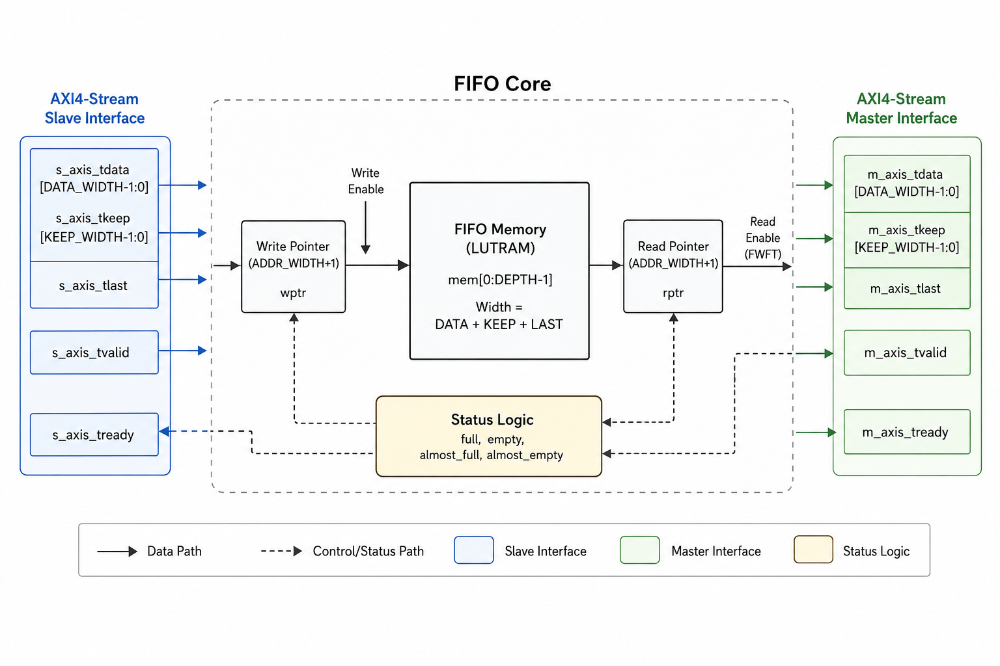
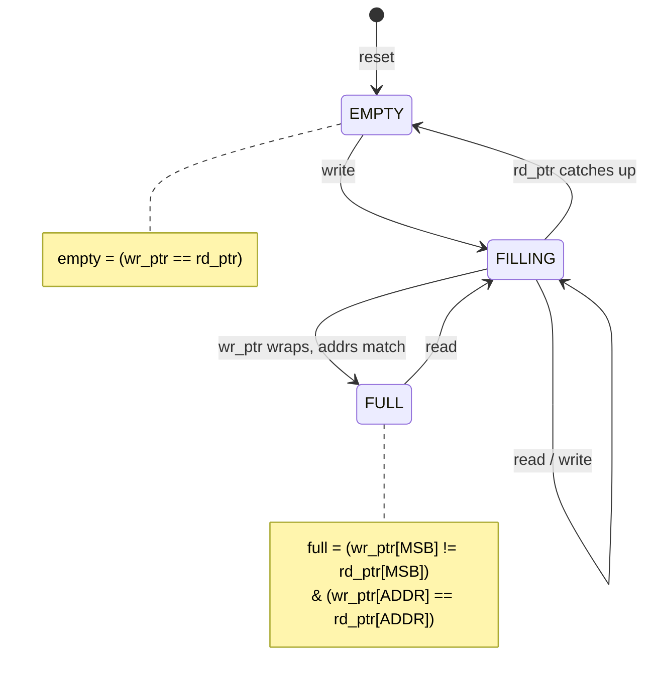
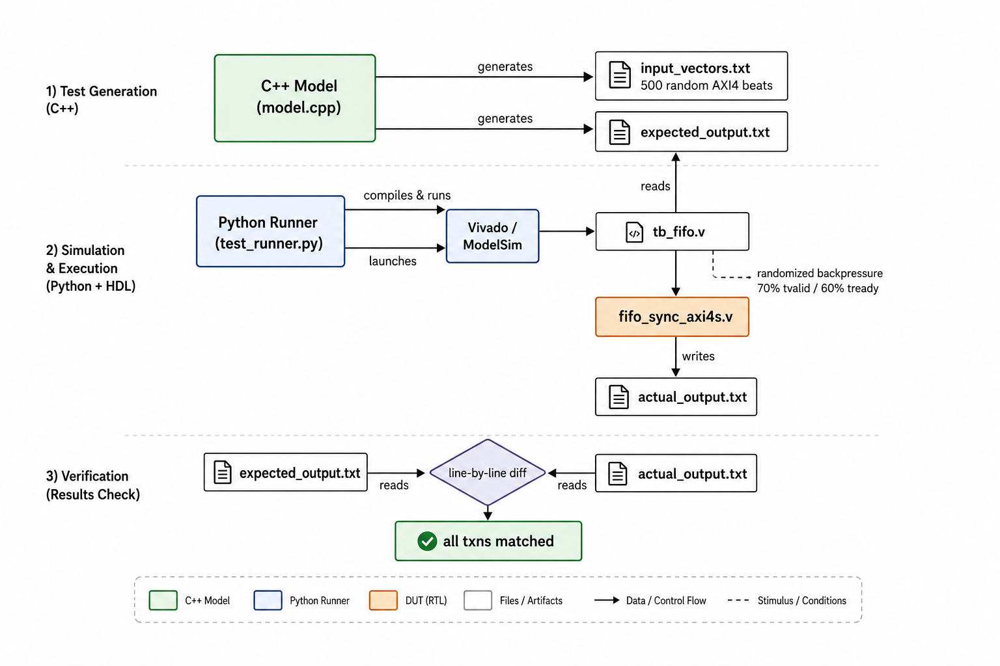
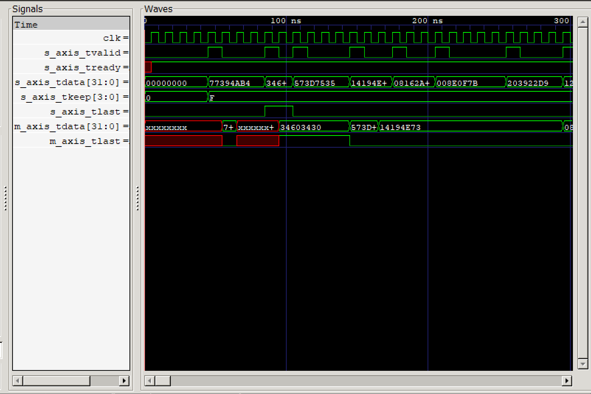
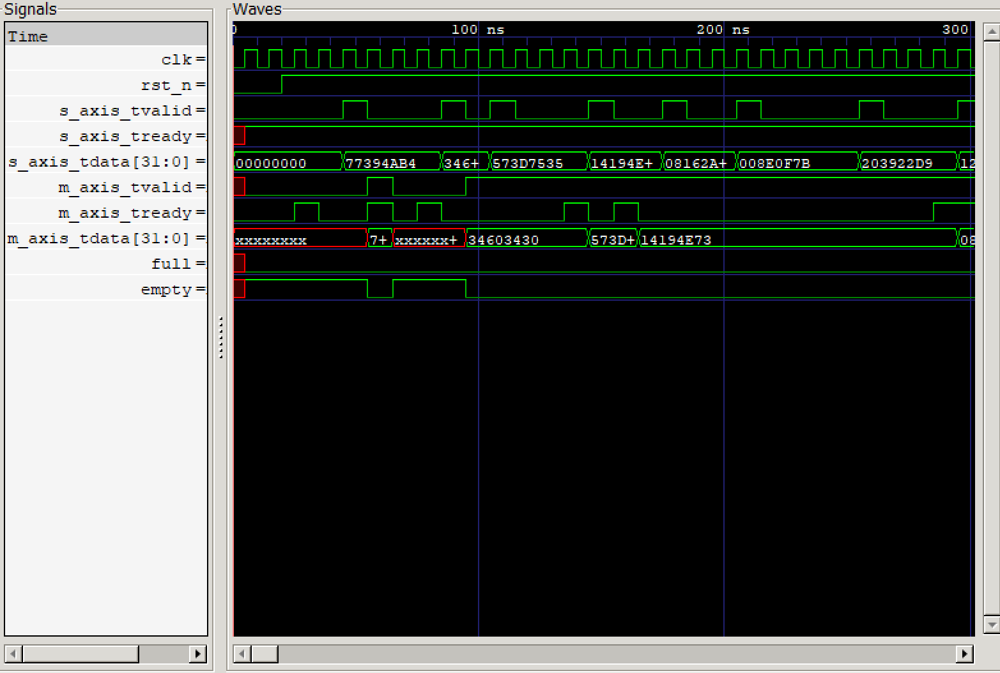

# AXI4-Stream Synchronous FIFO


Parameterizable synchronous FIFO in Verilog with a native AXI4-Stream interface (`tvalid`/`tready` handshake, `tlast`, `tkeep`). Verified against a C++ golden model — 500 randomized transactions, zero mismatches.

## What It Does

- AXI4-Stream slave/master ports with proper backpressure handling
- `tlast` packet boundaries and `tkeep` byte-enable masks on partial transfers
- Programmable `almost_full` / `almost_empty` thresholds so upstream logic can react before hitting the wall
- Synchronous active-low reset (no async reset nonsense)
- First-Word Fall-Through — data shows up on the output the same cycle `tvalid` asserts, no extra read latency

## Architecture

Internally it's a circular buffer with dual pointers (`wr_ptr`, `rd_ptr`) that are one bit wider than the address space. The extra MSB handles wraparound detection without needing modulo arithmetic — `full` is when the addresses match but the MSBs differ, `empty` is when both pointers are identical.

The memory is a LUTRAM array that stores `{tlast, tkeep, tdata}` packed together. Reads are combinatorial (FWFT), writes are synchronous on the clock edge gated by the handshake.





## Verification

I don't trust waveform-only verification for something like this. Instead there's a text-based regression flow that proves correctness:




**How it works:**

1. `model.cpp` pushes 500 randomized payloads through an `std::queue` (the "ideal FIFO") and dumps the input vectors + expected output to text files
2. The testbench (`tb_fifo.v`) reads those vectors and applies them to the DUT with randomized `tvalid` (70% assertion rate) and `tready` (60%) to simulate realistic bus stalls
3. The hardware output gets captured to `actual_output.txt`
4. `test_runner.py` diffs expected vs actual line-by-line — if they match, the design is correct

The randomized backpressure is the key part. It's easy to make a FIFO work when valid and ready are always high. The hard case is when the bus stalls mid-transfer, and the pointer logic has to hold state correctly.

### Waveforms

**AXI4-Stream handshake — write side with sideband signals:**



**Full signal view — backpressure and FIFO status flags:**



## Running It

Needs: `g++`, Python 3, and one of: Vivado, ModelSim, or Icarus Verilog. The test runner auto-detects your simulator.

```bash
python test_runner.py
```

If everything passes:
```
OK: all txns matched golden model
```

## Repo Layout

```
├── fifo_sync_axi4s.v      RTL — the actual FIFO
├── tb_fifo.v               Testbench — randomized AXI4-Stream driver
├── model.cpp               Golden model — C++ std::queue reference
├── test_runner.py           Orchestrator — compile, simulate, compare
└── docs/                    Architecture diagram + waveform screenshots
```

## Parameters

| Parameter | Default | Description |
|-----------|---------|-------------|
| `DATA_WIDTH` | 32 | Payload width in bits |
| `ADDR_WIDTH` | 4 | Address bits → depth is 2^ADDR_WIDTH (default 16) |
| `PROG_FULL_THRESH` | 12 | `almost_full` asserts at this occupancy |
| `PROG_EMPTY_THRESH` | 4 | `almost_empty` asserts at this occupancy |

---

*If this saved you time, star the repo. If you find a bug, open an issue.*
